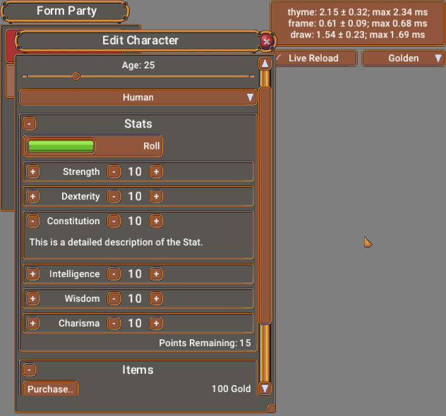

# Thyme - Themable Immediate Mode GUI

[](https://crates.io/crates/thyme)
[](https://docs.rs/thyme)

Thyme is a Graphical User Interface (GUI) library written in pure, safe, Rust.  All widgets are rendered using image sources, instead of the line art more commonly used by other Immediate Mode GUIs.  The image definitions, fonts, and style attributes are all specified in a unified theme.  This is generally drawn from a file, but any [Serde](https://serde.rs/) compatible source should work.  Live Reload is supported for asset files for a more efficient workflow.

A composite image showcasing three different themes:


Thyme produces a set of Draw Lists which are sent to a swappable graphics backend - currently [Glium](https://github.com/glium/glium) and [wgpu](https://github.com/gfx-rs/wgpu-rs) are supported.  The I/O backend is also swappable - although currently only [winit](https://github.com/rust-windowing/winit) is supported.  Fonts are rendered to a texture on the GPU using [rusttype](https://github.com/redox-os/rusttype).  

Performance is acceptable or better for most use cases, with the complete cycle of generating the widget tree, creating the draw data, and rendering taking less than 1 ms for quite complex UIs.

## Getting Started

### Running the examples

The demo contains an example role playing game (RPG) character generator program that uses many of the features of Thyme.

```bash
git clone https://github.com/Grokmoo/thyme.git
cd thyme
cargo run --example demo_glium --features glium_backend # Run demo using glium
cargo run --example demo_wgpu --features wgpu_backend # Run demo using wgpu
```

Run the hello_world example with either Glium or wgpu:
```bash
cargo run --example hello_glium --features glium_backend
cargo run --example hello_wgpu --features wgpu_backend
```

### Starting your own project

Add the following to your Cargo.toml file:

```toml
[dependencies]
thyme = { version = "0.3", features = ["wgpu_backend"] }
```

See [hello_wgpu](examples/hello_wgpu.rs) or [hello_glium](examples/hello_glium.rs) for the bare minimum to get started with your preferred renderer.  As a starting point, you can copy the [data](examples/data) folder into your own project and import the resources there, as in the example.

## [Documentation](https://docs.rs/thyme)

See the [docs](https://docs.rs/thyme) for the full API reference as well as theme definition format.

## Why Thyme?

At its core, Thyme is an immediate mode GUI library similar to other libraries such as [Dear ImGui](https://github.com/ocornut/imgui).  However,
unlike many of those libraries Thyme is focused on extreme customizability and flexibility needed for production applications, especially games.

With Thyme, you can customize exactly how you want your UI to look and operate.  Thyme also focuses a great deal on being performant, while still
retaining the benefits of a true immediate mode GUI.

This flexibility comes at the cost of needing to specify theme, font, and image files.  But, Thyme comes with some such files as examples to help you
get started.  Separating assets out in this manner can also significantly improve your workflow, especially with Thyme's built in support for live
reload.  This strikes a balance, enabling very fast iteration on layout and appearance while still keeping your UI logic in compiled Rust code.

This flexibility does come at a cost, of course - There is quite a bit of overhead in getting started compared to similar libraries.  Once you get up and
running, though, the overhead is fairly minor.  Performance is also very good and should be at least on-par with other immediate mode GUIs.

Thyme comes with a library of widgets similar to most UI libraries.  However, Thyme's widgets are written entirely using the public API, so the 
[`source`](src/recipes.rs) for these can serve as examples and templates for your own custom widgets.

It is also written from scratch in 100% Rust!

## License
[License]: #license

Licensed under Apache License, Version 2.0, ([LICENSE](LICENSE) or http://www.apache.org/licenses/LICENSE-2.0).

Note that some of the sample theme images are licensed under a Creative Commons license, see [attribution](examples/data/images/attribution.txt).

### License of contributions

Unless you explicitly state otherwise, any contribution intentionally submitted for inclusion in the work by you, as defined in the Apache-2.0 license, shall be licensed as above, without any additional terms or conditions.
